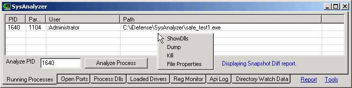
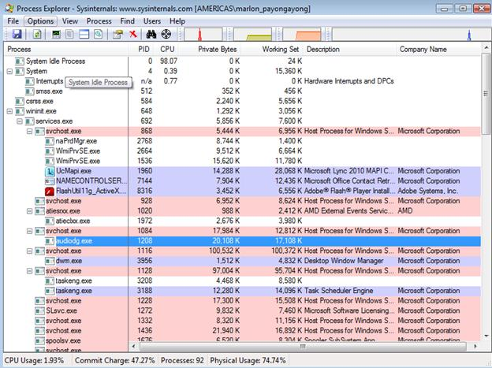
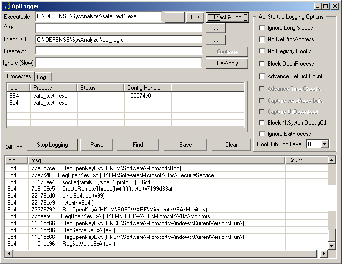
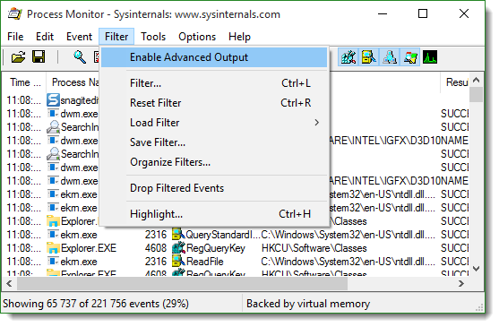
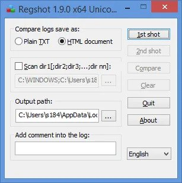
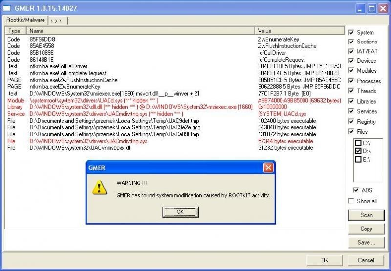

# Análisis de Malware

El análisis de malware es el estudio o proceso para determinar la funcionalidad, el origen y el impacto potencial de una muestra determinada de malware o sospechada de serlo.​
Para analizar muestras se suele usar un conjunto de herramientas que ademas de nombrar a continuación forman parte del [laboratorio oficial del foro](https://github.com/indetectables-net/toolkit).

#### Analizadores recomendados para Windows
Ya que un malware puede tener multitud de comportamientos, es recomendado usar una aplicación que integre y registre todas estas acciones. Entre muchas que hay disponibles como las tools de sysinternals e iDefense, la recomendada es [SysAnalizer](http://sandsprite.com/tools.php?id=13) Integra sniffer de conexiones, seguimiento a APIs, procesos y cambios en el registro. La herramienta completa para tener toda la información 

Al iniciar el análisis con esta herramienta, nos guiaran paso por paso por la información generada de forma muy visual con la opción de ver con detalles de primera mano las acciones del malware en el equipo.

Información como procesos activos, puertos activos, DLLs procesadas, drivers cargados, registro de cambios en el regedit, archivos y APIS son lo que tendremos a disposición para conocer los comportamientos del malware.

Análisis Selectivo De Comportamiento De Malware
Se puede hacer análisis individuales según lo que queramos saber sobre el malware, para esto existen otro multitud de herramientas útiles las cuales veremos a continuación

#### Analizando el tipo de protección malware
La primera cosa que se debe saber es determinar que tipo de archivo es el malware. Herramientas como [DIE](http://ntinfo.biz/index.php/) o [ExeinfoPe](http://www.exeinfo.xn.pl/) son muy útiles para saber si el archivo posee algún tipo de encriptación, protección o modificación. 

Si hiciera falta con esta información podemos usar herramientas unpacking genérico para desempaquetarlo, como lo son QUnpack, RL!dePacker y XVolkolak. En caso de no poder hacerlo con estas herramientas se puede recurrir a un desempaquetado manual más complejo usando un debugger para ver como se comporta la herramienta y desempacarla.

#### Analizando procesos activos
El malware al ser ejecutado puede lanzar varios procesos, es útil saber que esta ejecutándose para identificar los procesos nuevos que se generan y así saber cual es el que realiza acciones malignas, pues en ocasiones el malware emplea suplantación de procesos del sistema para pasar desapercibido. Herramientas como [Process Explorer](https://docs.microsoft.com/en-us/sysinternals/downloads/process-explorer) o [Process Hacker](https://processhacker.sourceforge.io/) nos permiten de forma visual ver los procesos activos en el sistema e identificar por reglas cual de ellos es maligno y así poder finalizarlo o analizarlo a fondo.

#### Analizando llamadas a APIs del sistema
Un malware puede ser identificado según las llamadas que haga a las APIs del sistema, de esta forma se puede establecer que usos o comportamientos hace valiéndose de los recursos de otros programas o del mismo sistema. Las llamadas a APIs a diferencia de los procesos pueden pasar desapercibidas fácilmente ya que son llamadas a .dlls o procedimientos inyectados en las mismas. Herramientas de API Logger (incluido en SysAnalizer) permiten tener una información completa sobre este tipo de comportamientos e identificar malware fácilmente.

En caso de encontrar llamadas a APIs sospechosas podremos identificar con claridad que objetos o procedimientos se invocan en las mismas (muy usual en métodos de inyección).

#### Analizando cambios en archivos
Se puede tener claridad de los cambios que genera un malware al ser ejecutado llevando un registro de los archivos que son modificados después que el mismo se ejecute. Herramientas como [Process Monitor](https://docs.microsoft.com/en-us/sysinternals/downloads/procmon) son una forma fácil para encontrar cambios en el sistema. Adicionalmente se puede conocer las búsquedas que hace el malware en carpetas y directorios.

En ocasiones el malware esta programado para hacer los cambios no inmediatamente sino después de cierto tiempo, por lo que es indispensable mantener un registro completo de actividades desde el momento de ejecución del malware hasta el momento de cierre del sistema para conocer todos los cambios.

#### Analizando strings del programa
Un string es una cadena de texto, analizar las cadenas de texto que sean visibles en un programa nos puede dar una idea de su funcionamiento. Para esto podemos usar un editor hexadecimal como [HxD](https://mh-nexus.de/en/hxd/) o un programa que extraiga los strings de la aplicación, como el [Strings](https://docs.microsoft.com/es-es/sysinternals/downloads/strings) y tener rápidamente conocimiento sobre el contenido del programa. En caso que el programa este protegido/encriptado no podremos tener una imagen clara de los strings, por lo que necesitaremos desempaquetarlo o des-protegerlo para poder verlos legibles. 

#### Analizando movimientos en el registro
[Regshot](http://downloads.sourceforge.net/regshot/) es una aplicación de código abierto, muy ligera y que cumple bastante bien su objetivo en tan solo unos cuantos minutos, además no requiere instalación. No solamente se limita a verificar cambios dentro del registro de Windows, también es capaz de verificar los cambios realizados dentro de alguna carpeta del sistema. Así podemos observar que valores se han agregado al registro, cuales claves fueron modificadas, archivos agregados junto con su ruta y que atributos de archivos han sido modificados.

#### Analizando conexiones activas
Es de gran utilidad conocer que conexiones se despliegan al ejecutar un malware, estos como en el caso de troyanos conectan a alguna dirección IP o puerto una vez se han ejecutado, así que teniendo un registro completo de nuestras conexiones y que procesos generan dichas conexiones TCP o UDP podremos identificar rápidamente una posible amenaza o intento de conexión. Herramientas como Active Ports o un simple netstat nos pueden ayudar en dicho fin. Otras herramientas para esto son [TCPView](https://docs.microsoft.com/en-us/sysinternals/downloads/tcpview) y [CurrPorts](https://www.nirsoft.net/utils/cports.html).

#### Analizando trafico generado por conexiones
En ocasiones no basta con saber a que puertos conecta un malware para identificar su comportamiento, por lo que se puede recurrir a sniffear el trafico que se genera en dichas conexiones y saber que información se esta enviando según los paquetes que se capturen en la comunicación. Muchos sniffers como [Wireshark](https://www.wireshark.org/) permiten tener una información, pero identificar de que proceso sale la conexión facilita aun más la tarea, pues nos permite saber que tipo de malware es, a que IPs se conecta y demás. Aplicaciones como SnifHit nos dan información completa sobre las mismas.

En el caso de IRCbots por ejemplo, podremos saber a que canal conecta, que comandos envía y toda esta información sera detallada. O en caso de conexiones UDP difíciles de sniffear tendremos los mismos resultados.

#### Analizando autoinicios en el sistema 
Una de las principales características del malware es su persistencia y tiempo de vida después de reiniciar la maquina. El malware se vale de entradas en el registro de Windows para iniciarse cada vez que el usuario inicie sesión en el equipo. 

Identificar los elementos de autoinicio y su localización en el registro ayuda para poder llegar a una solución para desinfectar la maquina. Estas entradas pueden estar en varios sectores como Run, RunOnce, ActiveX entre otros. Herramientas como [Autoruns](https://docs.microsoft.com/es-es/sysinternals/downloads/autoruns) nos permiten tener un informe completo acerca de dichas entradas y generar una solución rápida eliminándolas.

#### Análisis de rootkits
Ya que los rootkits trabajan de una manera diferente al malware común, se necesitan herramientas especializadas para detectar los hooks, modificaciones en la tabla de servicios (SSDT) y detección de códigos ocultos. [GMER](http://www.gmer.net/) es una utilidad avanzada de detección y eliminación de rootkits, esta permite tener una visión avanzada de las tablas de servicio, stealth code, hooks en drivers, librerías, IAT/EAT, DKOH, IRP, ejecuciones en kernel y demás métodos que usan los rootkits para alojarse en un sistema. En su modo "reporte" hace un listado completo del análisis de todos estos elementos, filtrando así los posibles hooks sospechosos o rootkits.

#### Análisis de malware online
Existen varios sitios en la red que permiten al usuario saber a ciencia cierta los comportamientos de un archivo al ser ejecutado sin comprometer la seguridad de su maquina. Estos generan un log completo que da una idea del comportamiento del malware al ser ejecutado. Aunque no son del todo certeros pues algunos malwares defensivos implementan la detección de entornos virtualizados, por lo que no ejecutan a totalidad sus funciones cuando son analizados por este tipo de herramientas.

Algunas de estas son [AnyRun](https://any.run/), [Intezer Analyze](https://analyze.intezer.com/) y [Hybrid Analysis](https://www.hybrid-analysis.com). Tambien offline tendriamos a [Cuckoo](https://cuckoosandbox.org/) y [Noriben](https://github.com/Rurik/Noriben).

