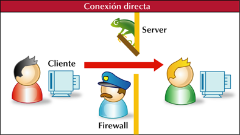
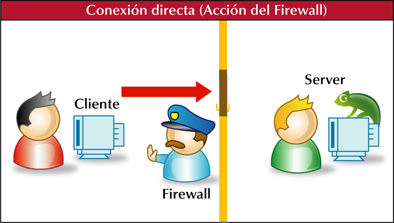
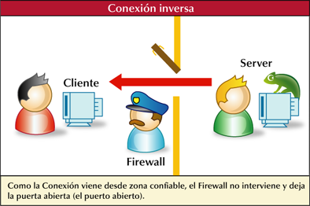

# TROYANOS: Conceptos básicos

## Partes de un Troyano
El troyano consta de:

* Cliente: Es el programa que manda las ordenes a ejecutar
* Servidor: Es el programa que tiene el infectado, este deja un puerto a la escucha
* Editor: Este nos permite editar las características de nuestro server; puerto, ip, inyección, etc.
* Otros: Estos pueden ser plugins tales como \*.dll para incorporarle algunas funciones al troyano.

## ¿Que hace un Troyano?
Las funciones que puede tener este son muy diversas, como ya he dicho anteriormente, todo depende del nivel de programación del programador, las intenciones de este y un poco menos influyente, el lenguage de programación y componentes empleados.

Los Troyanos pueden tener funciones como: 
* Keylogger
* Capturar pantalla
* Capturar webcam: este capta imágenes de forma rápida, pareciendo así como si de un video se tratase
* Ftp de archivos: nos permiten ver los archivos que contienen los distintos discos duros, pudiendo bajar y subir archivos
* Información del pc: nos permite conocer las características del PC remoto 
* Shell: esto nos permite obtener la shell del equipo remoto 
 
Estos son ejemplos simples de lo que normalmente tiene un Troyano, se podría decir que las funciones de este refleja la imaginación del programador.

## ¿Cuantos tipos de Troyanos hay según el modo de conexión?
Podemos clasificarlos en 3 tipos: 

1. Conexión Directa
1. Conexión Inversa
1. Conexión via web

**Regla prima:** Si tienes algún problema de conexión, comienza ensayando tus herramientas en 127.0.0.1 (IP Local) como DNS, de esa forma descartaras posibles problemas de configuración en la creación de tu server, puertos abiertos y demás variables.

### Conexión Directa:
Hablamos de conexión directa cuando nosotros (Cliente) nos conectamos al usuario infectado (Server). Es lo conexión mas habitual de los troyanos antiguos o backdoors, lo que hace es que el server deja escuchando un puerto y el cliente se conecta a través de ese puerto.

#### ¿Como puedo saber el puerto del remoto? ¿Y la ip?
El puerto hoy en dia, en los nuevos Troyanos, es 100% editable. Gracias a esto podemos dejar nuestro Server mas seguro y sigiloso pues no habrán conexiones salientes del remoto hacia nuestra maquina. Para saber la ip de nuestro infectado, existen muchísimos métodos de notificación

#### ¿Como funcionan?
Su funcionamiento es simple; nosotros al enviar el server dejamos un puerto abierto en la maquina infectada.
Luego nosotros desde el cliente, debemos conectarnos a la ip del infectado por el puerto abierto por el server.

**Fig. 1**

#### Notificaciones
Esto es un metodo que suelen traer Troyanos para mandarnos la ip de la maquina en la cual ha sido ejecutado el server. ¿Y como nos llega?
Nos puede llegar por diversas formas, comúnmente son por email y irc. A veces también ftp, o por un webserver.

#### Los inconvenientes de la Conexión Directa
Yo creo que ya nadie usa conexión directa, o solo muy pocos. Este tipo de conexión tiene muchas contras, como por ejemplo:
 1. Tienes que saber la dirección ip de tu infectado. Si los notificadores te fallan, tienes que averiguartela de otro modo.
 1. No puede traspasar routers, por lo tanto tampoco a una red.
 1. Puedes tener problemas al saltar el firewall del infectado. (ver fig. 2)
 1. Si la IP del server es dinámica y los métodos de notificación fallan, se habrá perdido una conexión.

**Fig. 2**

### Conexión Inversa
Esta vez es al revés, el infectado (Server) se conecta a nosotros (Cliente). Los troyanos de conexión inversa son los que hacen que el servidor sea el que se conecte al cliente.

Las ventajas de éste son que traspasan muchos firewalls y pueden ser usados en redes situadas detrás de un router sin problemas.

El motivo de por qué éste obtiene esas ventajas es que muchos firewalls no analizan los paquetes que salen de la computadora infectada (pero sí analizan los que entran) y se dice que traspasan redes porque no es necesario que se dirija la conexión hacia una computadora que se encuentre en la red. (ver fig. 3)

#### Tipos de IP y conexión inversa
Es habitual que un usuario que se conecta desde su hogar a Internet utilice una dirección IP que puede cambiar al reconectar; a esta forma de asignación de dirección IP se la denomina IP dinámica. Los sitios de Internet, servidores de correo, FTP, etc. que por su naturaleza necesitan estar permanentemente conectados generalmente tienen una dirección IP fija; a esta forma de asignación de dirección IP se la denomina IP estática.

Si configuramos un server para que se conecte a una determinada IP, y esa no es estática sino dinámica, la conexión se perderá cuando esta cambie.

Una solución para esta situación es el uso de DNS, una DNS es una dirección virtual que nos sirve para redirigir el trafico que conecte a ella a cualquier IP que deseemos, dándonos así la posibilidad de usar una DNS para cubrir los cambios de una IP Dinámica.

IP Dinámica <------> DNS <----- Server

IP Estática <--------- Server

**Fig. 3**

### Conexión via web
Este tipo de troyanos no utiliza un cliente para recibir la conexión, sino que emplea un sitio web para recibir conexiones y enviar ordenes a las maquinas. Serian lo que se conoce como Bots.

Tenemos entonces como intermediario entre los remotos y el administrador de la red una interfaz web que facilita el manejo de las maquinas. Como ejemplo de este tipo de troyanos tenemos el Apofis. Son muy similares a los ircbots, solo que en vez de tener un canal IRC se tiene una web como plataforma.

Conexión Servidor ------> Interfaz WEB <------- Administrador Red

### Los mejores troyanos
No hay mejor troyano, solo que los hay mas completos y mas estables.
Los más usados fueron en su momento **PoisonIvy 2**, el **Bifrost** y **Bandook 1.3**

### PREGUNTAS FRECUENTES SOBRE TROYANOS

#### ¿Tengo router y no puedo conectarme?
Si el Server no se conecta a ti puede ser por varias cosas, la mas común es que no tengas abiertos los puestos de tu router, tendrás que abrirlos antes para poder conectar.
También puede ser que el remoto tenga un firewall y no deje conectarse a Internet o simplemente que tu troyano sea detectado y su antivirus lo borre.

#### ¿Como puedo saber si anda bien el server?
La forma más segura para hacerlo es en un entorno virtual (VMWARE, VIRTUALPC) o en un entorno controlado o freezeado (DEEP FREEZE, SANDBOX), conectando a 127.0.0.1 como DNS y asegurándose que toda la configuración este correcta, tanto interna del server, como del cliente y sus necesidades para recibir la conexión (puertos, firewall, etc).
Si todo esta aparentemente bien configurado, puedes pensar en que una de estas cosas este fallando:

 1. Algún dato mal tipeado (como la dirección del DNS).
 1. No tenes actualizado tu DNS.
 1. Hay antivirus que aunque los cierres siguen protegiendo el equipo. Tendrías que ver de apagarlo completamente.

#### ¿Como saber si un server es detectado?
Para comprobar si un troyano es detectado lo mas fácil es usar nuestro antivirus, pero cada antivirus es distinto por lo tanto se tendría que probar con varios. 
Para facilitar esto hay varios escaners de varios antivirus a la vez:

 1. Online : Son paginas Web como VirusTotal, ademas de analizar la muestra y darnos el resultado las mandan a analizar a las compañías antivirus.
 1. Offline: Hay herramientas llamadas MultiAV que hacen el mismo trabajo localmente. De este tipo tenemos al KIMS que fue desarrollada por esta misma comunidad.

#### ¿Como se hace indetectable un troyano?
Históricamente los métodos son los siguientes, aunque actualmente ya algunos no son tan efectivos:

 1. Cambiar offsets detectados con editor hex
 1. Cambiar el código fuente detectado en ASM
 1. Usar encriptadores y compresores
 1. Empleando metodos como XOR, RIT, MEEPA

#### ¿Como envían los troyanos?
Lo mas frecuente para enviar un troyano suele ser enviarlo por email o por mensajería instantánea. Suelen enviarlos en archivos Zip aunque esto ultimo no es muy útil hoy en dia.

#### ¿Que DNS gratuitas se pueden usar para pruebas con troyanos?
Existen muchos sitios que nos permiten crear una direccion DNS para redirigir el trafico a nuestra IP, los mas usados son NO-IP y dyndns, pero ademas de esos existen muchos otros más:

[https://domain-dns.com/](https://domain-dns.com)

[https://dyndns.dk/](https://dyndns.dk)

[https://www.dynu.com/](https://www.dynu.com)

[https://www.eurodns.com/](https://www.eurodns.com)

[http://myip.org/](http://myip.org)

[http://www.dynddns.us/](http://www.dynddns.us)

[http://www.dnsexit.com/](http://www.dnsexit.com)

[https://dnslookup.me/dynamic-dns/](https://dnslookup.me/dynamic-dns/)

